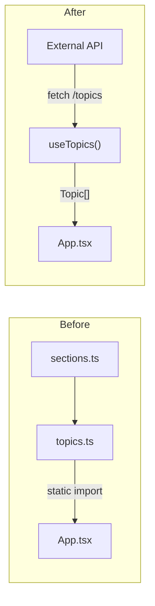

# Fetch Topics from External API with Security Hardening

Replace the static topic import in App with a `useTopics()` hook that fetches `Topic[]` from an external API via native `fetch`, adds loading/error UI states, hardens the app with CSP headers and runtime response validation, and updates the test suite to cover async data fetching.

## Tasks

- [ ] Add VITE_API_URL env var (.env.example, .gitignore)
- [ ] Create src/lib/api.ts with fetchTopics() and runtime response validation
- [ ] Create src/lib/use-topics.ts hook (loading/error/success states, retry, abort)
- [ ] Create LoadingState and ErrorState components
- [ ] Update App.tsx to use useTopics() hook instead of static import
- [ ] Add Content-Security-Policy headers to netlify.toml
- [ ] Create src/test/fixtures/topics.ts with mock data
- [ ] Add src/test/use-topics.test.tsx
- [ ] Update src/test/App.test.tsx to mock fetch and test loading/error/retry
- [ ] Update architecture.md, README.md, cursor rules, promotion-coverage.md

## API contract (assumed)

The external API exposes a single endpoint:

```
GET <VITE_API_URL>/topics  ->  Topic[]
```

The response shape matches the existing `Topic` interface from [`src/types/topics.ts`](../src/types/topics.ts). The API URL is configured via a `VITE_API_URL` environment variable.

## Architecture change



`src/data/sections.ts` and `src/data/topics.ts` remain in the repo as reference for the backend project but are no longer imported by the app at runtime.

## 1. Environment variable

- Create `.env.example` with `VITE_API_URL=http://localhost:3000` as documentation
- Add `.env` to `.gitignore` (if not already)
- Vite exposes it as `import.meta.env.VITE_API_URL`

## 2. API client — `src/lib/api.ts`

A thin typed wrapper around `fetch`:

```typescript
import type { Topic } from '@/types/topics'

const API_URL = import.meta.env.VITE_API_URL

export const fetchTopics = async (): Promise<Topic[]> => {
  const res = await fetch(`${API_URL}/topics`)

  if (!res.ok) {
    throw new Error(`Failed to fetch topics (${res.status})`)
  }

  const data: unknown = await res.json()

  if (!Array.isArray(data)) {
    throw new Error('Invalid API response: expected an array')
  }

  return data as Topic[]
}
```

Runtime validation guards against malformed responses (covers the "troubleshoots network" KEY topic). Full structural validation (checking every field) can be added later or via a schema library if desired.

## 3. Data-fetching hook — `src/lib/use-topics.ts`

```typescript
type TopicsState =
  | { status: 'loading' }
  | { status: 'error'; error: string }
  | { status: 'success'; topics: Topic[] }
```

- Calls `fetchTopics()` in a `useEffect` on mount
- Exposes a `retry()` callback that re-triggers the fetch
- Manages an `AbortController` to cancel in-flight requests on unmount

## 4. UI states in `App.tsx`

- **Loading**: new `LoadingState` component (a spinner or skeleton inside the existing panel layout)
- **Error**: new `ErrorState` component with the error message and a "Retry" button
- **Success**: current search/table UI, unchanged except `topics` comes from the hook instead of a static import

The `topics.length` references in the "Dataset snapshot" card and announcements will use the fetched array's length instead of the static import.

## 5. Security hardening

### CSP headers — `netlify.toml`

Add a `[[headers]]` block with a `Content-Security-Policy` that:

- Restricts `default-src` to `'self'`
- Allows `connect-src` to `'self'` and the API origin
- Allows `style-src` for Tailwind's inline styles
- Blocks `object-src`, `frame-src`

### Runtime response validation

Handled by the guard in `fetchTopics()` (step 2). Prevents the app from blindly trusting the API response shape.

### Search input

The existing normalization in [`src/lib/search.ts`](../src/lib/search.ts) already lowercases and collapses whitespace. No raw user input is injected into HTML (React escapes by default) or sent to the API, so no additional sanitization is needed.

## 6. Test changes

### Test fixtures — `src/test/fixtures/topics.ts`

A small array of 3-5 mock `Topic` objects used across tests. Decouples tests from the real 181-topic dataset.

### `src/test/use-topics.test.tsx`

- Mocks `global.fetch` with `vi.fn()`
- Tests loading -> success transition
- Tests loading -> error transition (network failure, non-200 status, malformed response)
- Tests retry after error
- Tests cleanup (abort on unmount)

### `src/test/App.test.tsx`

- Mocks `global.fetch` (or mocks `@/lib/api`) to return the fixture data
- All existing tests remain valid, just wrapped with async fetch resolution
- New tests: loading state renders, error state renders with retry button, retry refetches
- `topics.length` references replaced with `fixtures.length`

### `src/test/search.test.ts`

No changes needed — `searchTopics` is a pure function that already takes `Topic[]` as input.

## 7. Documentation updates

- [`docs/architecture.md`](architecture.md): update data model and "Why this supports later PR-data refinement" sections
- [`README.md`](../README.md): update Local dataset section, add `VITE_API_URL` to Commands/setup
- [`.cursor/rules/pr-atlas-context.mdc`](../.cursor/rules/pr-atlas-context.mdc): update key paths
- [`docs/promotion-coverage.md`](promotion-coverage.md): mark the 4 newly-covered KEY topics
